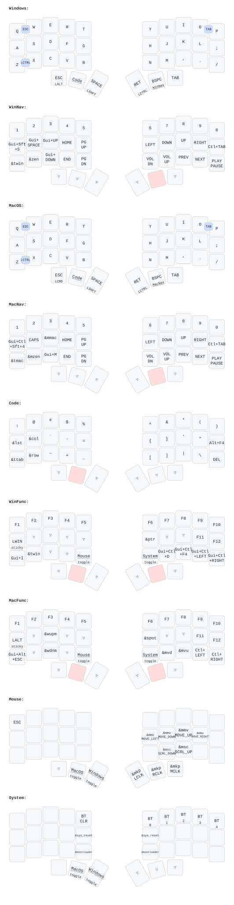

# Corne Wireless 5-Column View ZMK Config

此倉庫為 Corne 無線鍵盤的 ZMK 設定，採用 5 列鍵位視圖，提供多層佈局、常用巨集，並支援 nice!view 顯示與 ZMK Studio。



## 專案結構

* `config/corne.keymap`：主要層（WinDef/MacDef/WinNav/MacNav/Code/Func/SYS）、combos 與巨集定義。
* `config/corne.conf`：藍牙、省電、去彈跳與 ZMK Studio 等設定。
* `config/west.yml`：ZMK 專案 manifest，指定 ZMK 與相關依賴版本。
* `build.yaml`：GitHub Actions 建置矩陣，包含 left/right 與 nice!view 設定。
* `IMG/corne.svg`：鍵位圖（5 列視圖）。
* `drawer.py`：使用 `keymap-drawer` 將 `config/corne.keymap` 產生為 SVG。

## 層與巨集概覽

* 預設層：`WinDef`、`MacDef`
* 導航層：`WinNav`、`MacNav`
* 其他層：`Code`、`Func`、`SYS`
* 主要巨集：`ter_win`、`ter_mac`、`max_mac`、`rec_mac`

## GitHub Actions 建置

本專案採用 **GitHub Actions** 自動建置 ZMK 韌體。

每次推送變更後，GitHub Actions 會依照 `build.yaml` 中的建置矩陣產生對應韌體，包含：

* Corne 左半部
* Corne 右半部
* nice!view 顯示
* 其他於 `build.yaml` 中啟用的建置選項

建置完成後，可在 GitHub Actions 對應的 workflow run 中取得產生的韌體 artifacts。

### 建置設定

主要建置設定位於 `build.yaml`：

```yaml
include:
  - board: nice_nano_v2
    shield: corne_left nice_view_adapter nice_view

  - board: nice_nano_v2
    shield: corne_right nice_view_adapter nice_view
```

實際建置項目以目前 `build.yaml` 內容為準。

若需要啟用 ZMK Studio，則可依需求在 `build.yaml` 中加入對應的 Studio snippet。

## 韌體更新

1. 修改 `config/corne.keymap`、`config/corne.conf` 或其他 ZMK 設定。
2. Commit 並 push 到 GitHub。
3. GitHub Actions 自動執行建置。
4. 等待 workflow 完成。
5. 從 workflow run 的 Artifacts 下載對應的 `.uf2` 韌體。
6. 分別將左、右半部對應的韌體燒錄至 Nice!Nano v2。

> 建置產物以 GitHub Actions 為主要來源，不需要在本機安裝完整 Zephyr SDK 或執行 `west build`。

## 本地建置與除錯

如果需要在本機進行 ZMK 開發或除錯，可以使用 `west` 建置。

首先初始化 ZMK workspace：

```bash
west init -l config
west update
```

左半部：

```bash
west build -s zmk/app -d build/left -b nice_nano_v2 -- \
  -DSHIELD="corne_left nice_view_adapter nice_view" \
  -DZMK_CONFIG=$PWD/config
```

右半部：

```bash
west build -s zmk/app -d build/right -b nice_nano_v2 -- \
  -DSHIELD="corne_right nice_view_adapter nice_view" \
  -DZMK_CONFIG=$PWD/config
```

如需啟用 ZMK Studio，可在建置參數中加入：

```text
-DSNIPPET=studio-rpc-usb-uart
```

本地建置主要用於開發與問題排查，正式韌體建置仍以 GitHub Actions 為準。

## 產生鍵位圖

若需更新 README 中的鍵位圖，請先安裝提供 `keymap` 指令的 `keymap-drawer`，之後執行：

```bash
python main.py
```

腳本會：

1. 使用 `keymap parse` 解析 `config/corne.keymap`
2. 使用 `keymap draw` 產生 SVG
3. 將結果輸出至 `IMG/corne.svg`
4. 清理產生過程中的中間 YAML 檔案

更新鍵位配置後，建議同步重新產生鍵位圖。

## 驗證重點

* **層切換**：確認 `WinDef`、`MacDef`、`WinNav`、`MacNav`、`Code`、`Func`、`SYS` 的切換行為正常。
* **Combos**：確認各組合鍵觸發行為正常。
* **巨集**：確認 `ter_win`、`ter_mac`、`max_mac`、`rec_mac` 正常執行。
* **藍牙**：確認 `&bt BT_SEL n`、`&bt BT_CLR` 等功能正常。
* **省電**：確認睡眠與喚醒行為正常，並驗證 `CONFIG_ZMK_IDLE_SLEEP_TIMEOUT` 設定。
* **nice!view**：確認顯示器能正常啟動與更新。
* **GitHub Actions**：確認 CI 建置成功，並能產生左右半部對應的韌體 artifacts。

## 貢獻指南

Commit 建議使用 Conventional Commits，例如：

* `feat:`：新增功能
* `fix:`：修正問題
* `refactor:`：重構
* `build:`：建置相關變更
* `ci:`：CI/CD 相關變更
* `docs:`：文件更新

每次提交應盡量專注於單一變更。Pull Request 建議提供：

* 變更摘要
* 相關設定或 keymap 變更
* 更新後的鍵位圖（如適用）
* GitHub Actions 建置結果
* 實際鍵盤驗證結果

## 授權

本專案採用 MIT 授權，詳見 `LICENSE.md`。

