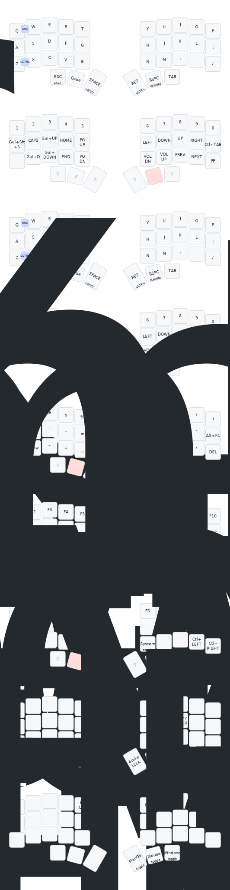

# Corne Wireless 5-Column View ZMK Config

此倉庫為 Corne 無線鍵盤的 ZMK 設定，採用 5 列鍵位視圖，提供多層佈局與常用巨集，並可選配 nice!view 顯示與 ZMK Studio。



## 專案結構

- `config/corne.keymap`：主要層（WinDef/MacDef/WinNav/MacNav/Code/Func/SYS）、combos 與巨集定義。
- `config/corne.conf`：藍牙、省電、去彈跳與（可選）Studio 設定。
- `config/west.yml`：ZMK 專案 manifest（目前固定 `zmk` v0.3）。
- `build.yaml`：CI 建置矩陣（left/right + nice!view；Studio snippet 可選）。
- `IMG/corne.svg`：鍵位圖（5 列視圖）。
- `drawer.py`：以 keymap CLI 由 `config/corne.keymap` 產生 SVG。

## 層與巨集概覽

- 預設層：`WinDef`、`MacDef`
- 導航層：`WinNav`、`MacNav`
- 其他層：`Code`、`Func`、`SYS`
- 主要巨集：`ter_win`、`ter_mac`、`max_mac`、`rec_mac`

## 產生鍵位圖（可選）

若需更新上方鍵位圖，請先安裝提供 `keymap` 指令的 keymap-drawer，之後執行：

```bash
python drawer.py
```

說明：腳本會以 `keymap parse` 解析 `config/corne.keymap`，再用 `keymap draw` 產生 `IMG/corne.svg`，並清理中間的 YAML。

## 建置與燒錄

前置：安裝 Zephyr SDK 與 West，並以本倉庫 `config/` 作為 ZMK 設定。

```bash
west init -l config && west update
# 左半
west build -s zmk/app -d build/left -b nice_nano_v2 -- \
  -DSHIELD="corne_left nice_view_adapter nice_view" \
  -DZMK_CONFIG=$PWD/config
west flash -d build/left
# 右半
west build -s zmk/app -d build/right -b nice_nano_v2 -- \
  -DSHIELD="corne_right nice_view_adapter nice_view" \
  -DZMK_CONFIG=$PWD/config
west flash -d build/right
```

- 若需啟用 ZMK Studio，可在上述兩側指令尾端加上 `-DSNIPPET=studio-rpc-usb-uart`。
- CI 版本參考 `build.yaml`；其中 Studio snippet 預設為註解（可視需求啟用）。

## 驗證重點

- 層切換：`Code`/`Func`/`SYS`（`&mo`, `&to`）行為正確。
- 巨集：`ter_win`、`ter_mac`、`max_mac`、`rec_mac` 正常執行。
- 藍牙：`&bt BT_SEL n`、`&bt BT_CLR`；喚醒/睡眠（`CONFIG_ZMK_IDLE_SLEEP_TIMEOUT`）。
- 顯示：nice!view 能正常刷新。

## 貢獻指南

- Commit 建議使用 Conventional Commits：`feat:`, `fix:`, `refactor:`, `build:`, `ci:` 等。
- 每次提交專注單一更動，PR 提供變更摘要、關鍵片段（前/後）或鍵位圖、以及本地驗證步驟。

## 授權

本專案採用 MIT 授權，詳見 `LICENSE.md`。
